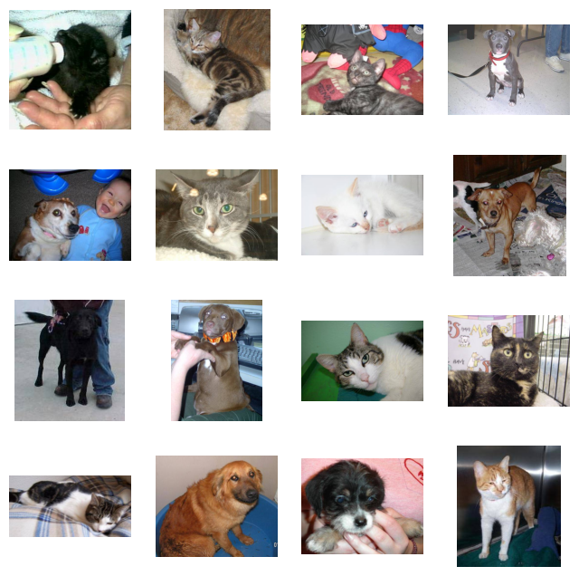
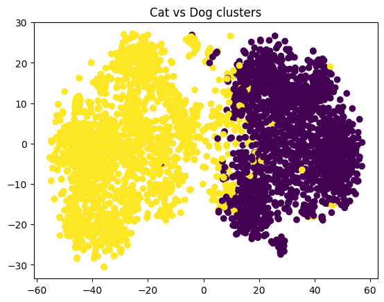

# Clustering de Imágenes de Perros y Gatos


<!-- WARNING: THIS FILE WAS AUTOGENERATED! DO NOT EDIT! -->

# Presentación y referencias

Para el entrenamiento de un modelo de machine learning existen
diferentes técnicas aplicables según los datos que se posean, siendo la
forma más común de entrenamiento aquella supervisada, en que
explícitamente se indíca a qué grupo o etiqueta pertenece un dato para
que el modelo aprenda. Sin embargo, este tipo de entrenamiento puede ser
no aplicable si, por ejemplo, el conjunto de datos no posee etiquetas
explícitas o se desean analizar tendencias en datos recopilados, siendo
necesario para estos casos el uso de metodologías como clustering:
entregar el conjunto a un algoritmo que sea capaz de identificar
similitudes entre los diferentes puntos y asignarlos a grupos según
estén más cerca unos de otros.

A modo de ejemplo inicial se utilizará el caso más simple: Clasificar
una imagen según su contenido, indicando si en esta se aprecia un perro
o un gato, utilizando datos no etiquetados para realizar el
entrenamiento.

## Referencias

- Definición:
  https://developers.google.com/machine-learning/clustering/overview
- Dataset: https://www.kaggle.com/datasets/chetankv/dogs-cats-images

# Problema

Se posee un conjunto de datos compuesto por imágenes que muestran perros
o gatos, inicialmente separadas para uso en entrenamiento supervisado.
Se desea utilizar estas imágenes para el entrenamiento y validación de
modelos de aprendizaje utilizando diferentes técnicas de clustering para
distinguir los diferentes juegos.

Para ello, será necesario: 1. Reunir las imágenes bajo una sola carpeta,
esto a fin de simular el tipo de entrenamiento sin etiquetas. Para fines
de aprendizaje se mantendrán indicadores como nombre de archivo para
saber a qué juego pertenece una imagen, pero esto no será utilizado en
el proceso de entrenamiento. 2. Analizar el set de datos, separando
imágenes de entrenamiento y de prueba del modelo. 3. Transformar las
imágenes: Una imagen no puede ser directamente utilizada para entrenar
un modelo, por lo que se requiere de una conversión especial a valores
utilizables. 4. Entrenar modelo. 5. Comprobar métricas de modelo
entrenado.

## EDA

Para comenzar con el proceso se debe, inicialmente, conocer el set de
datos con el que se trabaja. Para ello, se comenzará importando los
archivos a utilizar y a visualizarlos.

Inicialmente se lee el directorio del dataset

``` python
import os
os.chdir("../../data")
```

``` python
import os
import os
folder = "catsdogs"
file_paths=[]


for root, _, files in os.walk(folder):
    
    for file_path in files:
        if file_path.endswith((".png", ".jpg")):
            path = os.path.join(root, file_path)
            file_paths.append(path)


len(file_paths)
```

    4000

``` python
import matplotlib.pyplot as plt
import numpy as np
from PIL import Image

def show_samples(image_paths, n=9):
    idx = np.random.choice(len(image_paths), n, replace=False)
    plt.figure(figsize=(8, 8))
    for i, i_img in enumerate(idx):
        image_path=image_paths[i_img]
        img = np.array(Image.open(image_path).convert("RGB"))
        plt.subplot(int(np.sqrt(n)), int(np.sqrt(n)), i + 1)
        plt.imshow(img.astype("uint8"))
        plt.axis("off")
    plt.show()

# Example usage
show_samples(file_paths,16)
```



## Separación de entrenamiento y de prueba

Para separar datos para el entranamiento del modelo y de prueba se puede
utilizar la herramienta split de sklearn.

``` python
from sklearn.model_selection import train_test_split
X_train, X_test= train_test_split(
file_paths, test_size=0.2, random_state=42)
```

## Embedding

Las imágenes por sí solas, a pesar de que son significativas para un
humano, no pueden ser utilizadas para entrenamiento. El análisis pixel a
pixel no es efectivo para el aprendizaje, por lo que se utilizan
técnicas como el **embedding**: pasar la imagen por un modelo
especializado capaz de extraer información vectorial de la imagen que
podrá ser utilizada para entrenar.

En este ejemplo se utilizará ResNet para realizar el embedding, su
calidad no es la más óptima pero es más rápida que otras opciones.

``` python
import torch
from torchvision import models, transforms
from PIL import Image
import numpy as np
import os
```

``` python
resnet = models.resnet18(weights='IMAGENET1K_V1')
resnet = torch.nn.Sequential(*list(resnet.children())[:-1])  # remove classifier
resnet.eval()
```

    Downloading: "https://download.pytorch.org/models/resnet18-f37072fd.pth" to /root/.cache/torch/hub/checkpoints/resnet18-f37072fd.pth

    100%|██████████| 44.7M/44.7M [00:13<00:00, 3.36MB/s]

    Sequential(
      (0): Conv2d(3, 64, kernel_size=(7, 7), stride=(2, 2), padding=(3, 3), bias=False)
      (1): BatchNorm2d(64, eps=1e-05, momentum=0.1, affine=True, track_running_stats=True)
      (2): ReLU(inplace=True)
      (3): MaxPool2d(kernel_size=3, stride=2, padding=1, dilation=1, ceil_mode=False)
      (4): Sequential(
        (0): BasicBlock(
          (conv1): Conv2d(64, 64, kernel_size=(3, 3), stride=(1, 1), padding=(1, 1), bias=False)
          (bn1): BatchNorm2d(64, eps=1e-05, momentum=0.1, affine=True, track_running_stats=True)
          (relu): ReLU(inplace=True)
          (conv2): Conv2d(64, 64, kernel_size=(3, 3), stride=(1, 1), padding=(1, 1), bias=False)
          (bn2): BatchNorm2d(64, eps=1e-05, momentum=0.1, affine=True, track_running_stats=True)
        )
        (1): BasicBlock(
          (conv1): Conv2d(64, 64, kernel_size=(3, 3), stride=(1, 1), padding=(1, 1), bias=False)
          (bn1): BatchNorm2d(64, eps=1e-05, momentum=0.1, affine=True, track_running_stats=True)
          (relu): ReLU(inplace=True)
          (conv2): Conv2d(64, 64, kernel_size=(3, 3), stride=(1, 1), padding=(1, 1), bias=False)
          (bn2): BatchNorm2d(64, eps=1e-05, momentum=0.1, affine=True, track_running_stats=True)
        )
      )
      (5): Sequential(
        (0): BasicBlock(
          (conv1): Conv2d(64, 128, kernel_size=(3, 3), stride=(2, 2), padding=(1, 1), bias=False)
          (bn1): BatchNorm2d(128, eps=1e-05, momentum=0.1, affine=True, track_running_stats=True)
          (relu): ReLU(inplace=True)
          (conv2): Conv2d(128, 128, kernel_size=(3, 3), stride=(1, 1), padding=(1, 1), bias=False)
          (bn2): BatchNorm2d(128, eps=1e-05, momentum=0.1, affine=True, track_running_stats=True)
          (downsample): Sequential(
            (0): Conv2d(64, 128, kernel_size=(1, 1), stride=(2, 2), bias=False)
            (1): BatchNorm2d(128, eps=1e-05, momentum=0.1, affine=True, track_running_stats=True)
          )
        )
        (1): BasicBlock(
          (conv1): Conv2d(128, 128, kernel_size=(3, 3), stride=(1, 1), padding=(1, 1), bias=False)
          (bn1): BatchNorm2d(128, eps=1e-05, momentum=0.1, affine=True, track_running_stats=True)
          (relu): ReLU(inplace=True)
          (conv2): Conv2d(128, 128, kernel_size=(3, 3), stride=(1, 1), padding=(1, 1), bias=False)
          (bn2): BatchNorm2d(128, eps=1e-05, momentum=0.1, affine=True, track_running_stats=True)
        )
      )
      (6): Sequential(
        (0): BasicBlock(
          (conv1): Conv2d(128, 256, kernel_size=(3, 3), stride=(2, 2), padding=(1, 1), bias=False)
          (bn1): BatchNorm2d(256, eps=1e-05, momentum=0.1, affine=True, track_running_stats=True)
          (relu): ReLU(inplace=True)
          (conv2): Conv2d(256, 256, kernel_size=(3, 3), stride=(1, 1), padding=(1, 1), bias=False)
          (bn2): BatchNorm2d(256, eps=1e-05, momentum=0.1, affine=True, track_running_stats=True)
          (downsample): Sequential(
            (0): Conv2d(128, 256, kernel_size=(1, 1), stride=(2, 2), bias=False)
            (1): BatchNorm2d(256, eps=1e-05, momentum=0.1, affine=True, track_running_stats=True)
          )
        )
        (1): BasicBlock(
          (conv1): Conv2d(256, 256, kernel_size=(3, 3), stride=(1, 1), padding=(1, 1), bias=False)
          (bn1): BatchNorm2d(256, eps=1e-05, momentum=0.1, affine=True, track_running_stats=True)
          (relu): ReLU(inplace=True)
          (conv2): Conv2d(256, 256, kernel_size=(3, 3), stride=(1, 1), padding=(1, 1), bias=False)
          (bn2): BatchNorm2d(256, eps=1e-05, momentum=0.1, affine=True, track_running_stats=True)
        )
      )
      (7): Sequential(
        (0): BasicBlock(
          (conv1): Conv2d(256, 512, kernel_size=(3, 3), stride=(2, 2), padding=(1, 1), bias=False)
          (bn1): BatchNorm2d(512, eps=1e-05, momentum=0.1, affine=True, track_running_stats=True)
          (relu): ReLU(inplace=True)
          (conv2): Conv2d(512, 512, kernel_size=(3, 3), stride=(1, 1), padding=(1, 1), bias=False)
          (bn2): BatchNorm2d(512, eps=1e-05, momentum=0.1, affine=True, track_running_stats=True)
          (downsample): Sequential(
            (0): Conv2d(256, 512, kernel_size=(1, 1), stride=(2, 2), bias=False)
            (1): BatchNorm2d(512, eps=1e-05, momentum=0.1, affine=True, track_running_stats=True)
          )
        )
        (1): BasicBlock(
          (conv1): Conv2d(512, 512, kernel_size=(3, 3), stride=(1, 1), padding=(1, 1), bias=False)
          (bn1): BatchNorm2d(512, eps=1e-05, momentum=0.1, affine=True, track_running_stats=True)
          (relu): ReLU(inplace=True)
          (conv2): Conv2d(512, 512, kernel_size=(3, 3), stride=(1, 1), padding=(1, 1), bias=False)
          (bn2): BatchNorm2d(512, eps=1e-05, momentum=0.1, affine=True, track_running_stats=True)
        )
      )
      (8): AdaptiveAvgPool2d(output_size=(1, 1))
    )

``` python
# Preprocessing pipeline
preprocess = transforms.Compose([
    transforms.Resize(256),
    transforms.CenterCrop(224),
    transforms.ToTensor(),
    transforms.Normalize(mean=[0.485, 0.456, 0.406],
                         std=[0.229, 0.224, 0.225]),
])
```

``` python
def get_embedding(img_path):
    img = Image.open(img_path).convert("RGB")
    tensor = preprocess(img).unsqueeze(0)
    with torch.no_grad():
        vec = resnet(tensor).squeeze().numpy()
    return vec
```

``` python
embeddings = []


for file_path in X_train:
    if file_path.endswith((".jpg", ".png")):
        embeddings.append(get_embedding(file_path))
```

``` python
embeddings = np.stack(embeddings)
```

``` python
embeddings[0]
```

    array([0.6660489 , 1.5067581 , 1.1720809 , 0.09928348, 0.7595414 ,
           0.52907336, 0.37680218, 0.5935011 , 0.58511853, 0.8478365 ,
           1.2040572 , 0.550779  , 0.45986047, 0.19756901, 1.0678542 ,
           0.42736164, 1.9162145 , 0.18455608, 0.47536117, 2.3373675 ,
           0.9427633 , 1.1693491 , 1.06395   , 0.42626452, 1.819908  ,
           0.13539681, 0.10944423, 0.65889055, 0.34319258, 0.28679922,
           0.5872875 , 0.10163988, 0.33503887, 0.4189431 , 0.23393974,
           0.3489316 , 1.5463887 , 0.18802086, 1.3280172 , 0.9044388 ,
           0.2562643 , 0.26561958, 1.17356   , 0.2954022 , 0.6090607 ,
           1.0685513 , 1.9374801 , 2.5542696 , 0.0275197 , 0.02786867,
           0.25204724, 0.7856859 , 0.33865938, 0.5218359 , 0.73317444,
           0.2737378 , 0.88183576, 0.3833527 , 0.15546873, 0.5117959 ,
           1.6380799 , 1.6180423 , 0.31539845, 0.31592804, 1.022187  ,
           0.995148  , 1.0019306 , 3.4380617 , 0.6595206 , 0.38407055,
           0.23631021, 0.11156777, 0.41409844, 0.6694905 , 0.6383534 ,
           0.19130571, 1.5747482 , 0.6516894 , 1.0104846 , 0.40460125,
           0.31276757, 0.21153837, 0.26261687, 3.237561  , 0.35152653,
           0.37601367, 0.39206666, 2.968077  , 1.3805425 , 0.79147846,
           1.0453135 , 0.667056  , 0.41469795, 0.27790043, 0.9173185 ,
           1.0302966 , 1.3490325 , 1.5435506 , 5.2320867 , 0.34108996,
           2.8569164 , 0.94378805, 0.31713393, 0.66379464, 0.1370245 ,
           0.27654594, 1.245733  , 0.86901164, 1.3355709 , 1.125672  ,
           0.07387733, 1.6448724 , 0.5400315 , 2.1242404 , 0.5894703 ,
           2.051306  , 0.30483252, 0.23358364, 0.78098774, 0.37848145,
           0.8898685 , 0.8874283 , 2.2195346 , 0.69574696, 0.4452267 ,
           0.48326743, 0.4581352 , 0.8467374 , 0.4695763 , 0.04662188,
           0.80325097, 1.4098619 , 1.5311713 , 0.37128994, 1.6781628 ,
           1.4465301 , 1.4717574 , 0.73301166, 1.3933583 , 0.30993634,
           1.7886012 , 0.60616827, 0.5023143 , 1.6566957 , 0.792012  ,
           0.34510952, 0.02031085, 0.31282246, 1.3789271 , 0.40239218,
           1.6861548 , 0.9970566 , 1.8043798 , 1.6236693 , 0.6799459 ,
           0.07188577, 0.32588696, 1.3759501 , 0.43037567, 0.08071195,
           0.75810695, 0.30385864, 0.04573563, 2.1970031 , 2.181492  ,
           0.35039854, 0.11592013, 2.2362807 , 0.6912056 , 1.1434228 ,
           0.9611158 , 0.47445515, 2.8453987 , 1.772379  , 1.3390762 ,
           0.33753437, 0.931072  , 0.9651186 , 0.07906304, 0.08154298,
           2.8516908 , 0.11883808, 0.3132339 , 1.7154324 , 0.44320348,
           1.3151541 , 1.393374  , 1.4241388 , 0.53011864, 0.49262598,
           0.25049737, 0.8587346 , 0.62840724, 0.6738149 , 0.67374563,
           0.16118245, 0.39184433, 1.2694112 , 1.8534186 , 0.28906158,
           0.23018698, 0.37676656, 0.91739523, 0.34358618, 1.8338248 ,
           0.20998071, 0.8151898 , 0.36297446, 0.78977543, 0.44636244,
           0.65689063, 0.46518597, 1.0627301 , 0.3803843 , 0.896197  ,
           0.85261387, 0.3732263 , 0.61420804, 1.4201467 , 0.18512835,
           1.4582719 , 1.3403349 , 0.57537913, 0.16780853, 0.77009606,
           0.23838353, 0.5638563 , 0.04069984, 1.0106512 , 0.9376392 ,
           1.4278264 , 0.48553273, 0.5130364 , 1.4623892 , 0.6708821 ,
           0.8167044 , 0.28187642, 1.501033  , 1.339001  , 0.98367417,
           1.2345436 , 0.97441643, 0.29419452, 0.5941735 , 1.1337104 ,
           0.47382444, 2.0643733 , 0.8402505 , 0.3690344 , 0.5840555 ,
           0.17064756, 0.49118844, 0.22757486, 1.198927  , 0.5393598 ,
           0.7325811 , 0.60486495, 0.5504094 , 0.08209013, 0.12537336,
           0.33810917, 0.4536226 , 0.68981814, 2.058217  , 1.0204308 ,
           0.9887155 , 1.9482777 , 0.3047751 , 1.0330435 , 0.96921396,
           0.5742491 , 1.1348375 , 1.0520532 , 0.38890916, 4.256291  ,
           0.3463244 , 1.1224315 , 0.24269708, 0.10597012, 1.9835949 ,
           1.7052804 , 0.46931076, 1.2447449 , 1.3149635 , 0.7161805 ,
           0.20738335, 0.73248184, 0.715438  , 0.09552368, 1.3778453 ,
           0.85091126, 1.1660595 , 1.8865136 , 0.08011278, 0.44572064,
           1.5942515 , 2.1038237 , 0.3653819 , 0.3657886 , 0.7895889 ,
           1.1229641 , 0.48366395, 1.0861205 , 2.0040748 , 0.9092161 ,
           0.2542873 , 1.188232  , 1.3944521 , 0.7991982 , 0.56880283,
           0.4161041 , 0.30972996, 2.4470544 , 0.67144793, 0.        ,
           0.78099483, 1.7267588 , 3.0245192 , 0.7251788 , 1.6446848 ,
           1.3652618 , 0.57282925, 0.814621  , 0.83332753, 0.5278717 ,
           0.60143054, 1.0546925 , 0.38257334, 0.21508162, 0.738724  ,
           1.3598617 , 1.5511963 , 1.2241099 , 2.6072845 , 0.86486185,
           0.5667326 , 0.18789823, 1.162215  , 0.48364222, 0.17356215,
           0.3460326 , 1.8543849 , 1.0460995 , 0.32150298, 0.6942859 ,
           0.2120583 , 0.7007111 , 1.2210075 , 1.9469584 , 1.0032967 ,
           3.5340168 , 0.801531  , 0.36561695, 0.31251523, 2.146564  ,
           1.2975472 , 0.35912493, 0.33936703, 1.3338953 , 1.2121617 ,
           0.55418324, 1.5314094 , 0.2578946 , 0.26981896, 0.6906852 ,
           1.5102013 , 0.9192757 , 0.69505364, 2.912016  , 0.20428468,
           0.12706608, 0.35499078, 0.57894516, 0.67166376, 1.1141905 ,
           0.35857913, 1.0290879 , 2.0214221 , 0.10282855, 0.03167245,
           1.3475069 , 0.7615881 , 1.5303621 , 0.64554626, 1.5802841 ,
           0.        , 0.95186824, 0.46444947, 0.7717972 , 0.5478602 ,
           0.5196909 , 1.3255244 , 1.4892066 , 0.94423807, 1.3772703 ,
           0.5550966 , 0.20551355, 0.58554155, 0.57049733, 0.70894855,
           0.9093252 , 0.5885877 , 4.25877   , 0.23451018, 1.7314165 ,
           0.30912897, 0.6808283 , 1.6904188 , 0.1546592 , 1.3333542 ,
           1.0030882 , 1.1141725 , 1.2742689 , 1.9809499 , 1.8782976 ,
           3.825108  , 0.45739427, 0.3041232 , 1.1595117 , 0.50396746,
           0.33128512, 0.68486786, 0.20397428, 0.7411463 , 1.3316228 ,
           0.40054628, 0.8434588 , 0.78974485, 0.3329044 , 0.7425432 ,
           0.71264344, 0.14308058, 0.9461045 , 0.20726484, 1.0152706 ,
           0.9267496 , 2.1722202 , 0.24747853, 1.319976  , 0.83555526,
           0.68849665, 3.2497792 , 0.8439305 , 2.2044272 , 0.09239035,
           2.948526  , 0.6604365 , 0.8755351 , 0.11753934, 0.45912287,
           0.80053586, 0.48526093, 0.51112074, 0.15812041, 0.52662045,
           0.695991  , 1.2477996 , 0.63663244, 0.4357234 , 1.0282946 ,
           0.9389564 , 0.8985136 , 0.05777436, 0.34022647, 2.3855636 ,
           1.1900289 , 0.92942655, 1.0143471 , 1.5280305 , 0.15975519,
           1.4168413 , 0.01849614, 0.780458  , 1.0362319 , 0.50035316,
           1.3971897 , 1.0983068 , 0.45685548, 1.7386428 , 1.1596804 ,
           0.84466   , 1.0540711 , 0.89446825, 0.06567221, 0.8572843 ,
           0.96025854, 0.303731  , 0.68439513, 0.5858751 , 1.5743669 ,
           0.05334255, 0.07673894, 0.0604945 , 0.3421238 , 2.0277934 ,
           1.3190044 , 1.3581786 , 0.56377137, 0.23224969, 0.5167991 ,
           0.59052354, 0.8095064 , 0.7391249 , 0.63267857, 0.84056425,
           0.03690049, 0.06488372, 0.6762823 , 0.6599051 , 0.8429187 ,
           0.7836522 , 0.31115523], dtype=float32)

## Entrenar modelo

Para entrenar un modelo existen diferentes algoritmos a utilizar,
adaptados a diferentes finalidades. Entre ellos está KMeans, cuyo
parámetro principal es la cantidad de clusters a encontrar: a partir de
este parámetro intentará, de la forma que sea, encontrar esa N cantidad
de clusters que se indique, sean significativos o no. Como en este caso
es conocida la cantidad de elementos posibles, perro o gato, N es igual
a 2.

``` python
from sklearn.cluster import KMeans

kmeans = KMeans(n_clusters=2, random_state=23)
labels = kmeans.fit_predict(embeddings)
```

``` python
from sklearn.manifold import TSNE
import matplotlib.pyplot as plt

proj = TSNE(n_components=2, random_state=23).fit_transform(embeddings)
plt.scatter(proj[:, 0], proj[:, 1], c=labels, cmap='viridis')
plt.title("Cat vs Dog clusters")
plt.show()
```



``` python
for cluster in range(2):
    dogs=0
    cats=0
    print(f"Cluster {cluster}:")
    for file_path, lbl in zip(X_train, labels):
        if lbl == cluster:
            filename=file_path.split("/")[1]
            if "cat" in filename:
                cats+=1
            elif "dog" in filename:
                dogs+=1
    print(f"\t Cats: {cats}")
    print(f"\t Dogs: {dogs} \n")
```

    Cluster 0:
         Cats: 1473
         Dogs: 4 

    Cluster 1:
         Cats: 122
         Dogs: 1601 

# Probar modelo

Se utilizan los elementos del conjunto de pruebas para verificar los
resultados obtenidos.

``` python
test_embeddings=[]
for file_path in X_test:
    if file_path.endswith((".jpg", ".png",".jpeg")):
        test_embeddings.append(get_embedding(file_path))

testembeddings = np.stack(test_embeddings)

testlabels=kmeans.predict(testembeddings)
```

``` python
for cluster in range(2):
    print(f"Cluster {cluster}:")
    cats=0
    dogs=0
    for file_path, lbl in zip(X_test, testlabels):
        if lbl == cluster:
            if lbl == cluster:
                filename=file_path.split("/")[1]
                if "cat" in filename:
                    cats+=1
                elif "dog" in filename:
                    dogs+=1
    print(f"\t Cats: {cats}")
    print(f"\t Dogs: {dogs} \n")
```

    Cluster 0:
         Cats: 366
         Dogs: 0 

    Cluster 1:
         Cats: 39
         Dogs: 395 

# Guardar modelo

El modelo ya entrenado puede ser guardado y posteriormente cargado
mediante estas dos celdas respectivamente.

``` python
import joblib
joblib.dump(kmeans, "catsdogs.pkl")
```

    ['catsdogs.pkl']

``` python
import joblib
kmeans = joblib.load("catsdogs.pkl")
```
