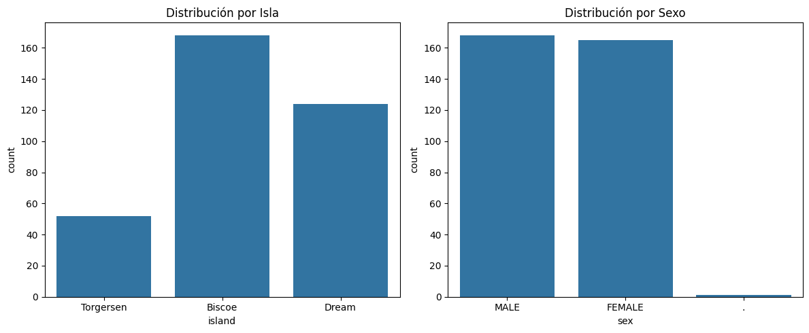
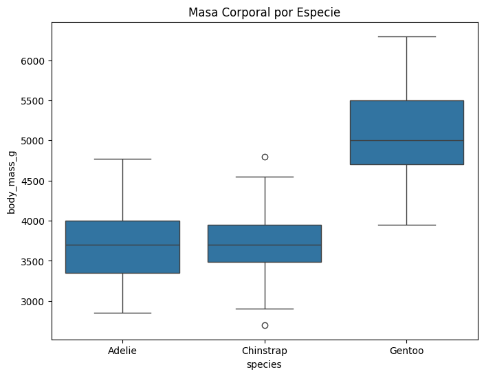
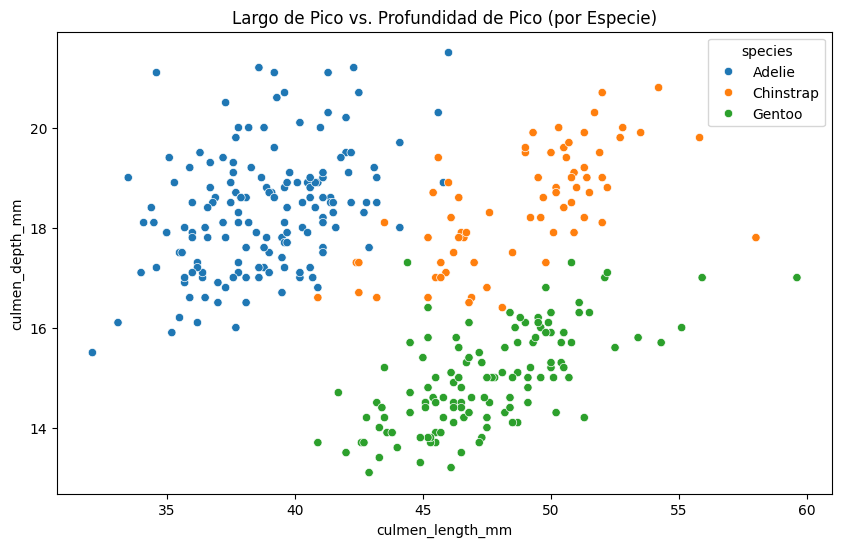

# EDA - Nivel 1


<!-- WARNING: THIS FILE WAS AUTOGENERATED! DO NOT EDIT! -->

## Nivel 1 - Análisis básico

En este nivel, nuestro objetivo es dominar lo básico: entender la
estructura de nuestros datos antes de intentar cualquier modelado
complejo.

Nos enfocaremos en las siguientes etapas:

- **Calidad del Dato**: Entender tipos de variables (numéricas
  vs. categóricas) y detectar valores nulos.
- **Análisis Univariado**: Estudiar cada variable por separado
  (distribución, conteos).
- **Limpieza Básica**: Resolver problemas sencillos de datos faltantes.
- **Relación Inicial**: Ver como algunas columnas ayudan a establecer
  una diferencia.

Para este ejemplo haremos uso de una fuente de datos simple, se trata de
un colección de datos sobre 3 especies de pingüinos antárticos.

- Adelie  
- Chinstrap
- Gentoo

El dataset contiene las siguientes columnas:

- species
- culmen_length_mm
- culmen_depth_mm
- flipper_length_mm
- body_mass_g
- island
- sex

Fuente: [Palmer Archipelago Antarctica Penguin
Data](https://www.kaggle.com/datasets/parulpandey/palmer-archipelago-antarctica-penguin-data)

# 1. CARGA DE DATOS

``` python
# Importamos las librerías necesarias
import pandas as pd
import numpy as np
import matplotlib.pyplot as plt
import seaborn as sns
from pathlib import Path
```

``` python
# Importamos el dataset

base_dir = Path.cwd()
csv_file_path = base_dir.parent.parent.parent / "data" / "penguins" / "penguins_size.csv"
df = pd.read_csv(csv_file_path, low_memory=False)

# Mostramos la primera fila del DataFrame para verificar que se ha cargado correctamente
df.head(1)
```

<div>
<style scoped>
    .dataframe tbody tr th:only-of-type {
        vertical-align: middle;
    }
&#10;    .dataframe tbody tr th {
        vertical-align: top;
    }
&#10;    .dataframe thead th {
        text-align: right;
    }
</style>

<table class="dataframe" data-quarto-postprocess="true" data-border="1">
<thead>
<tr style="text-align: right;">
<th data-quarto-table-cell-role="th"></th>
<th data-quarto-table-cell-role="th">species</th>
<th data-quarto-table-cell-role="th">island</th>
<th data-quarto-table-cell-role="th">culmen_length_mm</th>
<th data-quarto-table-cell-role="th">culmen_depth_mm</th>
<th data-quarto-table-cell-role="th">flipper_length_mm</th>
<th data-quarto-table-cell-role="th">body_mass_g</th>
<th data-quarto-table-cell-role="th">sex</th>
</tr>
</thead>
<tbody>
<tr>
<td data-quarto-table-cell-role="th">0</td>
<td>Adelie</td>
<td>Torgersen</td>
<td>39.1</td>
<td>18.7</td>
<td>181.0</td>
<td>3750.0</td>
<td>MALE</td>
</tr>
</tbody>
</table>

</div>

# 2. INSPECCIÓN GENERAL

### Objetivo

Antes de analizar nada, debemos entender la “forma” y la salud técnica
de los datos.

#### 1. Dimensiones

Primero verificamos el tamaño del dataset. ¿Cuántas observaciones
(filas) y variables (columnas) tenemos?

``` python
# .shape nos devuelve una tupla con el número de (filas, columnas)
print(f"Dimensiones del dataset: {df.shape}")
```

    Dimensiones del dataset: (344, 7)

> **Análisis:** Observamos que tenemos 344 filas y 7 columnas. Es un
> dataset pequeño, ideal para aprender.

#### 2. Tipos de Datos

Es fundamental saber qué columnas son numéricas y cuáles son texto
(objetos). Esto es crucial para evitar errores, como intentar calcular
el promedio de una columna de texto.

``` python
# .info() nos muestra los tipos de datos y si hay valores faltantes (null)
df.info()
```

    <class 'pandas.core.frame.DataFrame'>
    RangeIndex: 344 entries, 0 to 343
    Data columns (total 7 columns):
     #   Column             Non-Null Count  Dtype  
    ---  ------             --------------  -----  
     0   species            344 non-null    object 
     1   island             344 non-null    object 
     2   culmen_length_mm   342 non-null    float64
     3   culmen_depth_mm    342 non-null    float64
     4   flipper_length_mm  342 non-null    float64
     5   body_mass_g        342 non-null    float64
     6   sex                334 non-null    object 
    dtypes: float64(4), object(3)
    memory usage: 18.9+ KB

``` python
# De forma alternativa puedes usar .dtypes para ver los tipos de datos de cada columna
df.dtypes.value_counts()
```

    float64    4
    object     3
    Name: count, dtype: int64

> **Análisis:** Vemos que hay columnas ‘object’ (texto) como `species`,
> `island`, `sex`. También notamos que algunas columnas tienen menos de
> 344 valores ‘non-null’, lo que indica datos faltantes que deberemos
> tratar.

#### 3. Estadísticas Básicas

Damos un vistazo rápido a la distribución de las variables numéricas:
media, mínimo, máximo y desviación estándar. Esto nos ayuda a
identificar rangos extraños a primera vista.

``` python
# .describe() genera un resumen estadístico de las columnas numéricas
df.describe()
```

<div>
<style scoped>
    .dataframe tbody tr th:only-of-type {
        vertical-align: middle;
    }
&#10;    .dataframe tbody tr th {
        vertical-align: top;
    }
&#10;    .dataframe thead th {
        text-align: right;
    }
</style>

<table class="dataframe" data-quarto-postprocess="true" data-border="1">
<thead>
<tr style="text-align: right;">
<th data-quarto-table-cell-role="th"></th>
<th data-quarto-table-cell-role="th">culmen_length_mm</th>
<th data-quarto-table-cell-role="th">culmen_depth_mm</th>
<th data-quarto-table-cell-role="th">flipper_length_mm</th>
<th data-quarto-table-cell-role="th">body_mass_g</th>
</tr>
</thead>
<tbody>
<tr>
<td data-quarto-table-cell-role="th">count</td>
<td>342.000000</td>
<td>342.000000</td>
<td>342.000000</td>
<td>342.000000</td>
</tr>
<tr>
<td data-quarto-table-cell-role="th">mean</td>
<td>43.921930</td>
<td>17.151170</td>
<td>200.915205</td>
<td>4201.754386</td>
</tr>
<tr>
<td data-quarto-table-cell-role="th">std</td>
<td>5.459584</td>
<td>1.974793</td>
<td>14.061714</td>
<td>801.954536</td>
</tr>
<tr>
<td data-quarto-table-cell-role="th">min</td>
<td>32.100000</td>
<td>13.100000</td>
<td>172.000000</td>
<td>2700.000000</td>
</tr>
<tr>
<td data-quarto-table-cell-role="th">25%</td>
<td>39.225000</td>
<td>15.600000</td>
<td>190.000000</td>
<td>3550.000000</td>
</tr>
<tr>
<td data-quarto-table-cell-role="th">50%</td>
<td>44.450000</td>
<td>17.300000</td>
<td>197.000000</td>
<td>4050.000000</td>
</tr>
<tr>
<td data-quarto-table-cell-role="th">75%</td>
<td>48.500000</td>
<td>18.700000</td>
<td>213.000000</td>
<td>4750.000000</td>
</tr>
<tr>
<td data-quarto-table-cell-role="th">max</td>
<td>59.600000</td>
<td>21.500000</td>
<td>231.000000</td>
<td>6300.000000</td>
</tr>
</tbody>
</table>

</div>

> **Análisis:** Aquí vemos rangos de valores. Por ejemplo, la masa
> corporal va de 2700g a 6300g. No parecen haber valores negativos o
> imposibles (como peso 0) a simple vista.

# 3. ANÁLISIS DE VARIABLE OBJETIVO

### Objetivo

Conocer qué estamos intentando predecir. En este caso: **species**.

#### Pregunta clave

¿Está balanceado el dataset? ¿Hay muchos más pingüinos de una especie
que de otra?

``` python
plt.figure(figsize=(8, 5))
sns.countplot(x='species', data=df)
plt.title('Distribución de la Variable Objetivo (Species)')
plt.show()

# Verificamos los números exactos
print(df['species'].value_counts())
```


    species
    Adelie       152
    Gentoo       124
    Chinstrap     68
    Name: count, dtype: int64

> **Análisis:** Notamos que ‘Adelie’ es la clase mayoritaria (152),
> seguida de ‘Gentoo’ (124) y ‘Chinstrap’ (68). Hay un desbalance, pero
> no es extremo.

# 4. ANÁLISIS UNIVARIADO (VARIABLE POR VARIABLE)

### Objetivo

Ver cómo se comportan las variables “explicativas” (features) por
separado.

#### 4.1 Variables Numéricas

Analizaremos la distribución de variables como el largo de la aleta, la
masa corporal y las medidas del pico. Usaremos histogramas para ver si
siguen una distribución normal o si tienen sesgos.

``` python
# Seleccionamos columnas numéricas de interés
numeric_cols = ['culmen_length_mm', 'culmen_depth_mm', 'flipper_length_mm', 'body_mass_g']

plt.figure(figsize=(15, 10))
for i, col in enumerate(numeric_cols, 1):
    plt.subplot(2, 2, i)
    sns.histplot(df[col], kde=True, bins=20)
    plt.title(f'Distribución de {col}')

plt.tight_layout()
plt.show()
```


> **Análisis:**
>
> - **Flipper Length (Aleta):** Parece tener una distribución bimodal
>   (dos picos), lo que sugiere que podría haber dos grupos distintos de
>   pingüinos mezclados (quizás por especie).
> - **Body Mass (Masa):** Tiene un sesgo positivo (cola hacia la
>   derecha), indicando que hay menos pingüinos muy pesados.

#### 4.2 Variables Categóricas

Ahora veremos las variables cualitativas: Isla y Sexo.

``` python
fig, axes = plt.subplots(1, 2, figsize=(12, 5))

# Gráfico para Island
sns.countplot(x='island', data=df, ax=axes[0])
axes[0].set_title('Distribución por Isla')

# Gráfico para Sex
sns.countplot(x='sex', data=df, ax=axes[1])
axes[1].set_title('Distribución por Sexo')

plt.tight_layout()
plt.show()
```



> **Análisis:**
>
> - **Isla:** La isla ‘Biscoe’ tiene la mayor cantidad de registros.
> - **Sexo:** Parece haber un problema en la columna ‘sex’. Vemos una
>   barra muy pequeña o extraña (posiblemente un punto ‘.’ o valor nulo
>   malformado) además de Male/Female. Esto es un hallazgo de calidad de
>   datos importante.

# 5. LIMPIEZA DE DATOS

### Objetivo

Resolver problemas obvios antes de buscar relaciones complejas.

#### 1. Detección de Valores Nulos

Primero identificamos dónde están los valores faltantes (NaN).

``` python
# .isnull().sum() cuenta los valores nulos por columna
print(df.isnull().sum())

# También verificamos el valor extraño en 'sex' que vimos antes
print("\nValores únicos en 'sex':", df['sex'].unique())
```

    species               0
    island                0
    culmen_length_mm      2
    culmen_depth_mm       2
    flipper_length_mm     2
    body_mass_g           2
    sex                  10
    dtype: int64

    Valores únicos en 'sex': ['MALE' 'FEMALE' nan '.']

> **Análisis:**
>
> - Vemos algunos valores nulos en las variables numéricas y en `sex`.
> - Confirmamos que en `sex` hay un valor `.` que debe ser tratado como
>   nulo o error.

#### 2. Acción

En este nivel básico, aplicaremos dos estrategias comunes:

1.  **Imputación:** Rellenar los valores faltantes con un estimado
    razonable. Para variables categóricas como `sex`, usaremos la
    **moda** (el valor más frecuente).
2.  **Eliminación:** Si son pocas filas las que tienen datos faltantes
    en variables numéricas, podemos optar por eliminarlas para no
    introducir ruido.

``` python
# 1. Tratamos el valor '.' en 'sex' como NaN
df.loc[df['sex'] == '.', 'sex'] = np.nan

# 2. Imputamos 'sex' con la moda
moda_sex = df['sex'].mode()[0]
df['sex'] = df['sex'].fillna(moda_sex)
print(f"Valores nulos en 'sex' después de imputar: {df['sex'].isnull().sum()}")

# 3. Eliminamos filas con nulos restantes (en variables numéricas)
# Como son pocas (menos del 5% de los datos), la eliminación es segura en este nivel.
df = df.dropna()

# Verificamos que el dataset esté limpio
print("\nConteo de nulos final:")
print(df.isnull().sum())
print(f"\nDimensiones finales del dataset: {df.shape}")
```

    Valores nulos en 'sex' después de imputar: 0

    Conteo de nulos final:
    species              0
    island               0
    culmen_length_mm     0
    culmen_depth_mm      0
    flipper_length_mm    0
    body_mass_g          0
    sex                  0
    dtype: int64

    Dimensiones finales del dataset: (342, 7)

# 6. ANÁLISIS BIVARIADO (RELACIONES)

### Objetivo

En este punto verificaremos si las variables ayudan a separar las
especies.

#### 6.1 Numérico vs. Variable Objetivo

¿La masa corporal varía según la especie? Usaremos un **boxplot** para
visualizar la distribución de la masa corporal para cada especie.

``` python
plt.figure(figsize=(8, 6))
sns.boxplot(x='species', y='body_mass_g', data=df)
plt.title('Masa Corporal por Especie')
plt.show()
```



> **Análisis:**
>
> - Vemos que la especie **Gentoo** es claramente más pesada que las
>   otras dos (Adelie y Chinstrap).
> - Adelie y Chinstrap tienen rangos de peso similares, por lo que la
>   masa corporal por sí sola no es suficiente para distinguirlas entre
>   ellas.

#### 6.2 Numérico vs. Numérico (Scatterplot)

Este es el gráfico más poderoso. Veremos la relación entre el largo y la
profundidad del pico, coloreando los puntos por especie
(`hue='species'`).

``` python
plt.figure(figsize=(10, 6))
sns.scatterplot(x='culmen_length_mm', y='culmen_depth_mm', hue='species', data=df)
plt.title('Largo de Pico vs. Profundidad de Pico (por Especie)')
plt.show()
```



> **Análisis:**
>
> - Este gráfico es revelador. Podemos ver tres grupos claramente
>   separados.
> - **Adelie:** Picos cortos y profundos (abajo a la izquierda/centro).
> - **Gentoo:** Picos de longitud media pero menos profundos (abajo a la
>   derecha).
> - **Chinstrap:** Picos largos y profundos (arriba a la derecha).
> - Esto confirma que la combinación de estas dos variables es excelente
>   para clasificar las especies.

# 7. CONCLUSIONES

### Resumen de Hallazgos

Hemos completado nuestro primer Análisis Exploratorio de Datos (EDA).

**¿Qué hemos aprendido?**

1.  **Calidad de Datos:** El dataset es pequeño pero tenía problemas
    reales (valores nulos, un valor extraño en ‘sex’). Aprendimos a
    detectarlos y solucionarlos con estrategias básicas.
2.  **Variables Importantes:**
    - La **Masa Corporal** ayuda a separar a los *Gentoo* (más pesados)
      de los otros dos, pero confunde a *Adelie* y *Chinstrap*.
    - La combinación de **Largo de Pico** y **Profundidad de Pico** es
      la clave. El scatterplot nos mostró tres grupos bien definidos.

### Próximos Pasos (Nivel 2)

Aunque hemos limpiado y visualizado los datos, todavía no están listos
para un algoritmo de Machine Learning.

- **Codificación:** Los modelos matemáticos no entienden texto como
  “Male”, “Female” o “Biscoe”. Necesitaremos convertir estas categorías
  a números (Encoding).
- **Correlaciones:** Necesitamos medir matemáticamente qué tan fuerte es
  la relación entre variables (Matriz de Correlación).
