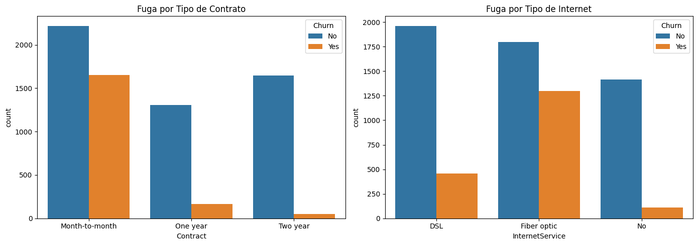

# EDA - Nivel 2


<!-- WARNING: THIS FILE WAS AUTOGENERATED! DO NOT EDIT! -->

## Nivel 2: Ingeniería y Preparación de Datos

En este nivel, subimos la dificultad. Ya no solo miramos los datos, sino
que los **preparamos** para que un modelo de Machine Learning pueda
entenderlos. Nos enfrentaremos a problemas del mundo real como datos
sucios ocultos y variables que necesitan transformación.

Nos enfocaremos en las siguientes etapas:

- **Detección de “Trampas”:** Identificar columnas que parecen correctas
  pero tienen errores ocultos.
- **Baseline Accuracy:** Entender el desbalance de clases (¿qué pasa si
  mi modelo dice siempre “No”?).
- **Feature Engineering:** Crear nuevas variables (bins) para mejorar la
  predicción.
- **Encoding:** Traducir texto a números (One-Hot Encoding) para los
  algoritmos.
- **Correlación:** Medir matemáticamente la relación entre variables.

Para este ejemplo usaremos el dataset **Telco Customer Churn**, que
contiene información sobre clientes de una empresa de telecomunicaciones
y si cancelaron su servicio (Churn).

Fuente: [Telco Customer
Churn](https://www.kaggle.com/datasets/blastchar/telco-customer-churn)

# 1. CARGA DE DATOS

``` python
# Importamos las librerías necesarias
import pandas as pd
import numpy as np
import matplotlib.pyplot as plt
import seaborn as sns
from pathlib import Path
```

``` python
# Importamos el dataset

base_dir = Path.cwd()
csv_file_path = base_dir.parent.parent.parent / "data" / "telco_customer_churn" / "Telco-Customer-Churn.csv"
df = pd.read_csv(csv_file_path, low_memory=False)

# Mostramos la primera fila del DataFrame para verificar que se ha cargado correctamente
df.head(1)
```

<div>
<style scoped>
    .dataframe tbody tr th:only-of-type {
        vertical-align: middle;
    }
&#10;    .dataframe tbody tr th {
        vertical-align: top;
    }
&#10;    .dataframe thead th {
        text-align: right;
    }
</style>

<table class="dataframe" data-quarto-postprocess="true" data-border="1">
<thead>
<tr style="text-align: right;">
<th data-quarto-table-cell-role="th"></th>
<th data-quarto-table-cell-role="th">customerID</th>
<th data-quarto-table-cell-role="th">gender</th>
<th data-quarto-table-cell-role="th">SeniorCitizen</th>
<th data-quarto-table-cell-role="th">Partner</th>
<th data-quarto-table-cell-role="th">Dependents</th>
<th data-quarto-table-cell-role="th">tenure</th>
<th data-quarto-table-cell-role="th">PhoneService</th>
<th data-quarto-table-cell-role="th">MultipleLines</th>
<th data-quarto-table-cell-role="th">InternetService</th>
<th data-quarto-table-cell-role="th">OnlineSecurity</th>
<th data-quarto-table-cell-role="th">...</th>
<th data-quarto-table-cell-role="th">DeviceProtection</th>
<th data-quarto-table-cell-role="th">TechSupport</th>
<th data-quarto-table-cell-role="th">StreamingTV</th>
<th data-quarto-table-cell-role="th">StreamingMovies</th>
<th data-quarto-table-cell-role="th">Contract</th>
<th data-quarto-table-cell-role="th">PaperlessBilling</th>
<th data-quarto-table-cell-role="th">PaymentMethod</th>
<th data-quarto-table-cell-role="th">MonthlyCharges</th>
<th data-quarto-table-cell-role="th">TotalCharges</th>
<th data-quarto-table-cell-role="th">Churn</th>
</tr>
</thead>
<tbody>
<tr>
<td data-quarto-table-cell-role="th">0</td>
<td>7590-VHVEG</td>
<td>Female</td>
<td>0</td>
<td>Yes</td>
<td>No</td>
<td>1</td>
<td>No</td>
<td>No phone service</td>
<td>DSL</td>
<td>No</td>
<td>...</td>
<td>No</td>
<td>No</td>
<td>No</td>
<td>No</td>
<td>Month-to-month</td>
<td>Yes</td>
<td>Electronic check</td>
<td>29.85</td>
<td>29.85</td>
<td>No</td>
</tr>
</tbody>
</table>

<p>1 rows × 21 columns</p>
</div>

# 2. LIMPIEZA DE TIPOS DE DATOS

### Objetivo

Comprender el resultado de `.info()`

#### El Problema

A primera vista, todas las columnas parecen estar bien. Pero hay una
“trampa” común en este dataset.

``` python
df.info()
```

    <class 'pandas.core.frame.DataFrame'>
    RangeIndex: 7043 entries, 0 to 7042
    Data columns (total 21 columns):
     #   Column            Non-Null Count  Dtype  
    ---  ------            --------------  -----  
     0   customerID        7043 non-null   object 
     1   gender            7043 non-null   object 
     2   SeniorCitizen     7043 non-null   int64  
     3   Partner           7043 non-null   object 
     4   Dependents        7043 non-null   object 
     5   tenure            7043 non-null   int64  
     6   PhoneService      7043 non-null   object 
     7   MultipleLines     7043 non-null   object 
     8   InternetService   7043 non-null   object 
     9   OnlineSecurity    7043 non-null   object 
     10  OnlineBackup      7043 non-null   object 
     11  DeviceProtection  7043 non-null   object 
     12  TechSupport       7043 non-null   object 
     13  StreamingTV       7043 non-null   object 
     14  StreamingMovies   7043 non-null   object 
     15  Contract          7043 non-null   object 
     16  PaperlessBilling  7043 non-null   object 
     17  PaymentMethod     7043 non-null   object 
     18  MonthlyCharges    7043 non-null   float64
     19  TotalCharges      7043 non-null   object 
     20  Churn             7043 non-null   object 
    dtypes: float64(1), int64(2), object(18)
    memory usage: 1.1+ MB

> **Observación:** Fíjate en la columna `TotalCharges`. Aparece como
> `object` (texto), pero debería ser numérica (float). Esto sucede
> porque contiene espacios vacíos `" "` que pandas interpreta como
> texto.

``` python
# Forzamos la conversión a numérico. 'coerce' convierte los errores (espacios) en NaN
df['TotalCharges'] = pd.to_numeric(df['TotalCharges'], errors='coerce')

# Verificamos cuántos nulos se generaron
print(f"Valores nulos en TotalCharges: {df['TotalCharges'].isnull().sum()}")

# Imputamos los nulos con la mediana (es más robusta a outliers que la media)
df['TotalCharges'] = df['TotalCharges'].fillna(df['TotalCharges'].median())
```

    Valores nulos en TotalCharges: 11

# 3. ANÁLISIS DEL DESBALANCE DE CLASES

### Objetivo

Entender que en la vida real, los casos positivos (ej. fraude, fuga)
suelen ser la minoría.

#### Baseline Accuracy

Si asumimos que nadie se va (predicimos siempre “No Churn”), ¿qué tan
precisos seríamos?

``` python
plt.figure(figsize=(6, 4))
sns.countplot(x='Churn', data=df)
plt.title('Distribución de la Fuga (Churn)')
plt.show()

# Calculamos el porcentaje exacto
print(df['Churn'].value_counts(normalize=True) * 100)
```


    Churn
    No     73.463013
    Yes    26.536987
    Name: proportion, dtype: float64

> **Análisis:**
>
> - Vemos que aproximadamente el **73%** de los clientes NO se van
>   (Clase Mayoritaria).
> - **¿Qué significa este 73%?** Es nuestro **Baseline Accuracy** (Línea
>   Base).
>   - Imagina un “modelo dummy” que simplemente adivina que *ningún*
>     cliente se irá. Este modelo acertaría el 73% de las veces sin
>     saber nada.
>   - Por lo tanto, **cualquier modelo de Machine Learning que
>     construyamos debe tener una precisión SUPERIOR al 73%** para que
>     valga la pena. Si nuestro modelo tiene 70% de accuracy, es peor
>     que no hacer nada.

# 4. ANÁLISIS BIVARIADO CATEGÓRICO (INSIGHTS DE NEGOCIO)

### Objetivo

Ver cómo las categorías afectan la fuga. Responderemos preguntas de
negocio clave.

``` python
fig, axes = plt.subplots(1, 2, figsize=(14, 5))

# Contrato vs Churn
sns.countplot(x='Contract', hue='Churn', data=df, ax=axes[0])
axes[0].set_title('Fuga por Tipo de Contrato')

# Servicio de Internet vs Churn
sns.countplot(x='InternetService', hue='Churn', data=df, ax=axes[1])
axes[1].set_title('Fuga por Tipo de Internet')

plt.tight_layout()
plt.show()
```



> **Insights:**
>
> - **Contrato:** Los clientes con contrato “Month-to-month” tienen una
>   tasa de fuga altísima comparada con los de “Two year”.
> - **Internet:** Los usuarios de “Fiber optic” tienden a irse más que
>   los de “DSL”. Esto podría indicar problemas de calidad o precio en
>   el servicio de fibra.

# 5. FEATURE ENGINEERING (CREACIÓN DE VARIABLES)

### Objetivo

Crear nueva información a partir de la existente para ayudar al modelo.

#### Binning (Agrupación)

La variable `tenure` (meses de permanencia) es numérica. A veces el
comportamiento de los clientes se entiende mejor por grupos (Nuevos vs
Leales).

``` python
# Definimos los rangos (bins) y las etiquetas
bins = [0, 12, 24, 48, 100]
labels = ['0-12 Meses', '12-24 Meses', '24-48 Meses', '+48 Meses']

# Creamos la nueva columna
df['tenure_group'] = pd.cut(df['tenure'], bins=bins, labels=labels)

# Visualizamos la fuga por grupo de permanencia
plt.figure(figsize=(8, 5))
sns.countplot(x='tenure_group', hue='Churn', data=df)
plt.title('Fuga por Tiempo de Permanencia')
plt.show()
```


# 6. CODIFICACIÓN DE VARIABLES (ENCODING)

### Objetivo

Transformar texto a números, ya que los modelos de ML no entienden
“Yes”, “No”, “Male”, “Female”.

#### Estrategia

1.  **Binarios (2 opciones):** Mapeo directo a 0 y 1.
2.  **Nominales (\>2 opciones):** One-Hot Encoding (crear columnas
    dummy).

``` python
# 1. Variables Binarias Manuales
# Primero verificamos que no haya nulos en estas columnas
binary_cols = ['gender', 'Partner', 'Dependents', 'PhoneService', 'PaperlessBilling', 'Churn']
for col in binary_cols:
    print(f"Valores únicos en {col}: {df[col].unique()}")

df['gender'] = df['gender'].map({'Male': 1, 'Female': 0})
df['Partner'] = df['Partner'].map({'Yes': 1, 'No': 0})
df['Dependents'] = df['Dependents'].map({'Yes': 1, 'No': 0})
df['PhoneService'] = df['PhoneService'].map({'Yes': 1, 'No': 0})
df['PaperlessBilling'] = df['PaperlessBilling'].map({'Yes': 1, 'No': 0})
df['Churn'] = df['Churn'].map({'Yes': 1, 'No': 0})
```

    Valores únicos en gender: ['Female' 'Male']
    Valores únicos en Partner: ['Yes' 'No']
    Valores únicos en Dependents: ['No' 'Yes']
    Valores únicos en PhoneService: ['No' 'Yes']
    Valores únicos en PaperlessBilling: ['Yes' 'No']
    Valores únicos en Churn: ['No' 'Yes']

### ¿Qué es One-Hot Encoding?

Para variables con más de 2 opciones (como `InternetService`: DSL, Fiber
optic, No), no podemos simplemente asignarles números 1, 2, 3. ¿Por qué?
Porque el modelo pensaría que 3 es “mayor” que 1, y eso no es cierto (la
fibra óptica no es “mayor” que el DSL, es solo diferente).

**Solución:** Creamos una nueva columna para cada opción posible.

- `InternetService_DSL` (1 si es DSL, 0 si no)
- `InternetService_Fiber optic` (1 si es Fibra, 0 si no) … y así
  sucesivamente.

``` python
# 2. One-Hot Encoding para el resto
# Seleccionamos las columnas categóricas restantes (excluyendo las que ya convertimos o no sirven como customerID)
cat_cols = ['MultipleLines', 'InternetService', 'OnlineSecurity', 'OnlineBackup', 
            'DeviceProtection', 'TechSupport', 'StreamingTV', 'StreamingMovies', 
            'Contract', 'PaymentMethod', 'tenure_group']

# pd.get_dummies crea las nuevas columnas (drop_first=True evita la multicolinealidad)
df_encoded = pd.get_dummies(df, columns=cat_cols, drop_first=True)

# Eliminamos customerID que no aporta valor predictivo
if 'customerID' in df_encoded.columns:
    df_encoded.drop(columns=['customerID'], inplace=True)

print(f"Dimensiones originales: {df.shape}")
print(f"Dimensiones después del Encoding: {df_encoded.shape}")
df_encoded.head(3)
```

    Dimensiones originales: (7043, 22)
    Dimensiones después del Encoding: (7043, 34)

<div>
<style scoped>
    .dataframe tbody tr th:only-of-type {
        vertical-align: middle;
    }
&#10;    .dataframe tbody tr th {
        vertical-align: top;
    }
&#10;    .dataframe thead th {
        text-align: right;
    }
</style>

<table class="dataframe" data-quarto-postprocess="true" data-border="1">
<thead>
<tr style="text-align: right;">
<th data-quarto-table-cell-role="th"></th>
<th data-quarto-table-cell-role="th">gender</th>
<th data-quarto-table-cell-role="th">SeniorCitizen</th>
<th data-quarto-table-cell-role="th">Partner</th>
<th data-quarto-table-cell-role="th">Dependents</th>
<th data-quarto-table-cell-role="th">tenure</th>
<th data-quarto-table-cell-role="th">PhoneService</th>
<th data-quarto-table-cell-role="th">PaperlessBilling</th>
<th data-quarto-table-cell-role="th">MonthlyCharges</th>
<th data-quarto-table-cell-role="th">TotalCharges</th>
<th data-quarto-table-cell-role="th">Churn</th>
<th data-quarto-table-cell-role="th">...</th>
<th data-quarto-table-cell-role="th">StreamingMovies_No internet
service</th>
<th data-quarto-table-cell-role="th">StreamingMovies_Yes</th>
<th data-quarto-table-cell-role="th">Contract_One year</th>
<th data-quarto-table-cell-role="th">Contract_Two year</th>
<th data-quarto-table-cell-role="th">PaymentMethod_Credit card
(automatic)</th>
<th data-quarto-table-cell-role="th">PaymentMethod_Electronic check</th>
<th data-quarto-table-cell-role="th">PaymentMethod_Mailed check</th>
<th data-quarto-table-cell-role="th">tenure_group_12-24 Meses</th>
<th data-quarto-table-cell-role="th">tenure_group_24-48 Meses</th>
<th data-quarto-table-cell-role="th">tenure_group_+48 Meses</th>
</tr>
</thead>
<tbody>
<tr>
<td data-quarto-table-cell-role="th">0</td>
<td>0</td>
<td>0</td>
<td>1</td>
<td>0</td>
<td>1</td>
<td>0</td>
<td>1</td>
<td>29.85</td>
<td>29.85</td>
<td>0</td>
<td>...</td>
<td>False</td>
<td>False</td>
<td>False</td>
<td>False</td>
<td>False</td>
<td>True</td>
<td>False</td>
<td>False</td>
<td>False</td>
<td>False</td>
</tr>
<tr>
<td data-quarto-table-cell-role="th">1</td>
<td>1</td>
<td>0</td>
<td>0</td>
<td>0</td>
<td>34</td>
<td>1</td>
<td>0</td>
<td>56.95</td>
<td>1889.50</td>
<td>0</td>
<td>...</td>
<td>False</td>
<td>False</td>
<td>True</td>
<td>False</td>
<td>False</td>
<td>False</td>
<td>True</td>
<td>False</td>
<td>True</td>
<td>False</td>
</tr>
<tr>
<td data-quarto-table-cell-role="th">2</td>
<td>1</td>
<td>0</td>
<td>0</td>
<td>0</td>
<td>2</td>
<td>1</td>
<td>1</td>
<td>53.85</td>
<td>108.15</td>
<td>1</td>
<td>...</td>
<td>False</td>
<td>False</td>
<td>False</td>
<td>False</td>
<td>False</td>
<td>False</td>
<td>True</td>
<td>False</td>
<td>False</td>
<td>False</td>
</tr>
</tbody>
</table>

<p>3 rows × 34 columns</p>
</div>

``` python
# Verificamos los tipos de datos resultantes
df_encoded.dtypes.value_counts()
```

    bool       24
    int64       8
    float64     2
    Name: count, dtype: int64

``` python
# Luego del procesamiento tenemos valores boolean que para efectos prácticos
# pueden ser tratados como enteros 0/1 por el proceso de entrenamiento.
# Sin embargo es mejor convertirlos explícitamente a int para evitar problemas de tipo de datos en el modelo.
# Seleccionamos todas las columnas bool
bool_cols = df_encoded.select_dtypes(include="bool").columns

# Convertimos a int (0/1)
df_encoded[bool_cols] = df_encoded[bool_cols].astype(int)

# Visualizamos nuevamente los tipos de datos
df_encoded.dtypes.value_counts()
```

    int64      32
    float64     2
    Name: count, dtype: int64

# 7. MATRIZ DE CORRELACIÓN

### Objetivo

Ver relaciones matemáticas ahora que todo es numérico.

``` python
plt.figure(figsize=(12, 8))
# Calculamos la correlación con la variable objetivo 'Churn'
corr_churn = df_encoded.corr()['Churn'].sort_values(ascending=False)

# Mostramos las 10 variables más correlacionadas positivamente y las 5 más negativas
print("Top Correlaciones Positivas:\n", corr_churn.head(10))
print("\nTop Correlaciones Negativas:\n", corr_churn.tail(5))

# Heatmap de las variables más importantes (opcional, para no saturar el gráfico)
top_cols = corr_churn.index[:15] # Las 15 más altas
sns.heatmap(df_encoded[top_cols].corr(), annot=True, fmt=".2f", cmap='coolwarm')
plt.show()
```

    Top Correlaciones Positivas:
     Churn                             1.000000
    InternetService_Fiber optic       0.308020
    PaymentMethod_Electronic check    0.301919
    MonthlyCharges                    0.193356
    PaperlessBilling                  0.191825
    SeniorCitizen                     0.150889
    StreamingTV_Yes                   0.063228
    StreamingMovies_Yes               0.061382
    MultipleLines_Yes                 0.040102
    tenure_group_12-24 Meses          0.020308
    Name: Churn, dtype: float64

    Top Correlaciones Negativas:
     TechSupport_No internet service   -0.227890
    StreamingTV_No internet service   -0.227890
    tenure_group_+48 Meses            -0.263222
    Contract_Two year                 -0.302253
    tenure                            -0.352229
    Name: Churn, dtype: float64


# 8. CONCLUSIONES Y SIGUIENTES PASOS

### Resumen

1.  **Limpieza:** Descubrimos que `TotalCharges` tenía espacios vacíos y
    los corregimos.
2.  **Insights:**
    - Los contratos mensuales y la fibra óptica son factores de riesgo
      de fuga.
    - Los clientes nuevos (0-12 meses) son los más propensos a irse.
3.  **Preparación:** Hemos convertido todo a números. El dataset pasó de
    ~20 columnas a más de 30 debido al One-Hot Encoding.

### Reflexión para Nivel 3

El One-Hot Encoding es útil, pero… ¿qué pasaría si tuviéramos una
columna como “Código Postal” con 500 categorías? Nuestro dataset
crecería enormemente (High Cardinality).
