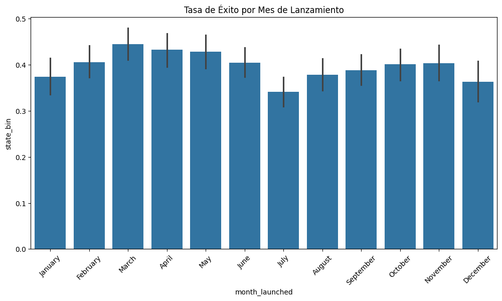
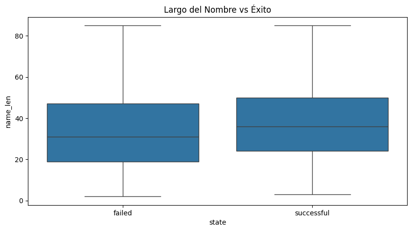
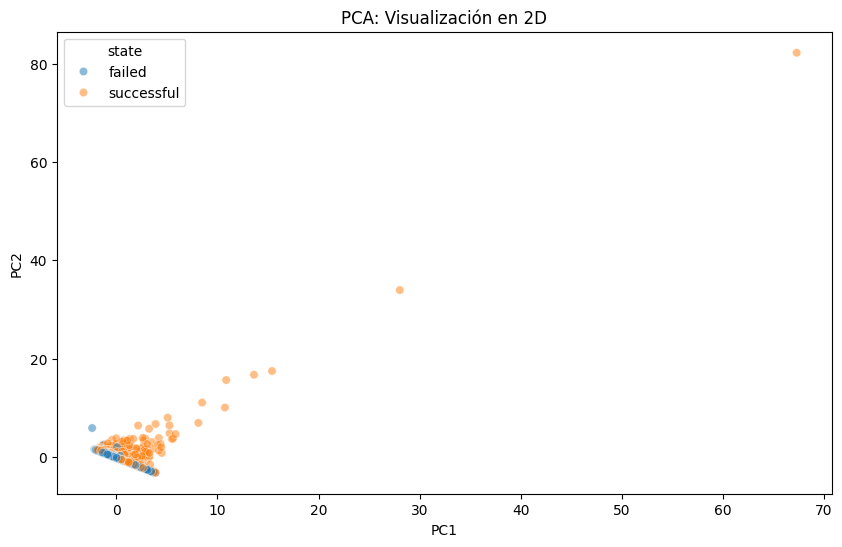

# EDA - Nivel 3


<!-- WARNING: THIS FILE WAS AUTOGENERATED! DO NOT EDIT! -->

## Nivel 3: Datos Complejos, NLP y Estadística

En este nivel final, nos enfrentamos a la realidad de los datos “sucios”
y complejos. Trabajaremos con fechas, texto libre y categorías con
cientos de opciones.

Nos enfocaremos en:

- **Fechas:** Extraer inteligencia de columnas de tiempo.
- **Alta Cardinalidad:** ¿Qué hacer con categorías que tienen 100+
  opciones?
- **NLP Básico:** Extraer información de texto (títulos de proyectos).
- **Transformaciones:** Logaritmos para datos sesgados y PCA para
  reducción de dimensiones.
- **Validación Estadística:** Ir más allá de los gráficos con tests de
  hipótesis.

Usaremos el dataset de **Kickstarter Projects**, analizando qué hace que
un proyecto tenga éxito o fracase.

Fuente: [Kicksarter
Projects](https://www.kaggle.com/datasets/kemical/kickstarter-projects)

# 1. CARGA Y LIMPIEZA INICIAL

### Objetivo

Limpiar el ruido. Los datasets reales vienen con IDs internos, columnas
duplicadas y formatos de fecha incorrectos.

``` python
# Importamos las librerías necesarias
import pandas as pd
import numpy as np
import matplotlib.pyplot as plt
import seaborn as sns
from pathlib import Path
```

``` python
# Importamos el dataset

base_dir = Path.cwd()
csv_file_path = base_dir.parent.parent.parent / "data" / "kickstarter" / "ks_projects_201612_sample.csv"
df = pd.read_csv(csv_file_path, low_memory=False)

# Mostramos la primera fila del DataFrame para verificar que se ha cargado correctamente
df.head(1)
```

<div>
<style scoped>
    .dataframe tbody tr th:only-of-type {
        vertical-align: middle;
    }
&#10;    .dataframe tbody tr th {
        vertical-align: top;
    }
&#10;    .dataframe thead th {
        text-align: right;
    }
</style>

<table class="dataframe" data-quarto-postprocess="true" data-border="1">
<thead>
<tr style="text-align: right;">
<th data-quarto-table-cell-role="th"></th>
<th data-quarto-table-cell-role="th">ID</th>
<th data-quarto-table-cell-role="th">name</th>
<th data-quarto-table-cell-role="th">category</th>
<th data-quarto-table-cell-role="th">main_category</th>
<th data-quarto-table-cell-role="th">currency</th>
<th data-quarto-table-cell-role="th">deadline</th>
<th data-quarto-table-cell-role="th">goal</th>
<th data-quarto-table-cell-role="th">launched</th>
<th data-quarto-table-cell-role="th">pledged</th>
<th data-quarto-table-cell-role="th">state</th>
<th data-quarto-table-cell-role="th">backers</th>
<th data-quarto-table-cell-role="th">country</th>
<th data-quarto-table-cell-role="th">usd pledged</th>
<th data-quarto-table-cell-role="th">Unnamed: 13</th>
<th data-quarto-table-cell-role="th">Unnamed: 14</th>
<th data-quarto-table-cell-role="th">Unnamed: 15</th>
<th data-quarto-table-cell-role="th">Unnamed: 16</th>
</tr>
</thead>
<tbody>
<tr>
<td data-quarto-table-cell-role="th">0</td>
<td>379677482</td>
<td>Fico - The World's 1st Finger Condom for your ...</td>
<td>Product Design</td>
<td>Design</td>
<td>EUR</td>
<td>2015-12-02 22:59:13</td>
<td>1600</td>
<td>2015-11-02 22:59:13</td>
<td>116</td>
<td>failed</td>
<td>11</td>
<td>FR</td>
<td>127.6735788</td>
<td>NaN</td>
<td>NaN</td>
<td>NaN</td>
<td>NaN</td>
</tr>
</tbody>
</table>

</div>

``` python
# Paso 1: Inspección de Columnas
# Imprimimos la lista de columnas para ver si notamos algo extraño
print(df.columns.tolist())
```

    ['ID ', 'name ', 'category ', 'main_category ', 'currency ', 'deadline ', 'goal ', 'launched ', 'pledged ', 'state ', 'backers ', 'country ', 'usd pledged ', 'Unnamed: 13', 'Unnamed: 14', 'Unnamed: 15', 'Unnamed: 16']

> **Observación:** ¡Cuidado! Si miras con atención, verás que algunas
> columnas tienen espacios al final (ej. `'launched '`, `'state '`).
> Esto es un error muy común en CSVs sucios y hará que nuestro código
> falle si buscamos `df['launched']`.

``` python
# Solución: Limpiamos los espacios en blanco de los nombres de las columnas
df.columns = df.columns.str.strip()

# Verificamos que se haya arreglado
print(df.columns.tolist())
```

    ['ID', 'name', 'category', 'main_category', 'currency', 'deadline', 'goal', 'launched', 'pledged', 'state', 'backers', 'country', 'usd pledged', 'Unnamed: 13', 'Unnamed: 14', 'Unnamed: 15', 'Unnamed: 16']

### 1.1 Eliminación de Ruido

Tenemos columnas como `ID` que no sirven para predecir, y columnas
`Unnamed`.

``` python
cols_to_drop = ['ID', 'currency', 'Unnamed: 13', 'Unnamed: 14', 'Unnamed: 15', 'Unnamed: 16'] 
df.drop(columns=[c for c in cols_to_drop if c in df.columns], inplace=True)
df.head(1)
```

<div>
<style scoped>
    .dataframe tbody tr th:only-of-type {
        vertical-align: middle;
    }
&#10;    .dataframe tbody tr th {
        vertical-align: top;
    }
&#10;    .dataframe thead th {
        text-align: right;
    }
</style>

<table class="dataframe" data-quarto-postprocess="true" data-border="1">
<thead>
<tr style="text-align: right;">
<th data-quarto-table-cell-role="th"></th>
<th data-quarto-table-cell-role="th">name</th>
<th data-quarto-table-cell-role="th">category</th>
<th data-quarto-table-cell-role="th">main_category</th>
<th data-quarto-table-cell-role="th">deadline</th>
<th data-quarto-table-cell-role="th">goal</th>
<th data-quarto-table-cell-role="th">launched</th>
<th data-quarto-table-cell-role="th">pledged</th>
<th data-quarto-table-cell-role="th">state</th>
<th data-quarto-table-cell-role="th">backers</th>
<th data-quarto-table-cell-role="th">country</th>
<th data-quarto-table-cell-role="th">usd pledged</th>
</tr>
</thead>
<tbody>
<tr>
<td data-quarto-table-cell-role="th">0</td>
<td>Fico - The World's 1st Finger Condom for your ...</td>
<td>Product Design</td>
<td>Design</td>
<td>2015-12-02 22:59:13</td>
<td>1600</td>
<td>2015-11-02 22:59:13</td>
<td>116</td>
<td>failed</td>
<td>11</td>
<td>FR</td>
<td>127.6735788</td>
</tr>
</tbody>
</table>

</div>

### 1.2 El Problema de las Fechas

Pandas carga las fechas como texto (`object`) por defecto si no tienen
un formato estándar perfecto.

``` python
# Verificamos los tipos de datos actuales de las fechas
print(df[['launched', 'deadline']].dtypes)
df[['launched', 'deadline']].head(3)
```

    launched    object
    deadline    object
    dtype: object

<div>
<style scoped>
    .dataframe tbody tr th:only-of-type {
        vertical-align: middle;
    }
&#10;    .dataframe tbody tr th {
        vertical-align: top;
    }
&#10;    .dataframe thead th {
        text-align: right;
    }
</style>

<table class="dataframe" data-quarto-postprocess="true" data-border="1">
<thead>
<tr style="text-align: right;">
<th data-quarto-table-cell-role="th"></th>
<th data-quarto-table-cell-role="th">launched</th>
<th data-quarto-table-cell-role="th">deadline</th>
</tr>
</thead>
<tbody>
<tr>
<td data-quarto-table-cell-role="th">0</td>
<td>2015-11-02 22:59:13</td>
<td>2015-12-02 22:59:13</td>
</tr>
<tr>
<td data-quarto-table-cell-role="th">1</td>
<td>2013-04-24 22:03:25</td>
<td>2013-06-23 01:59:00</td>
</tr>
<tr>
<td data-quarto-table-cell-role="th">2</td>
<td>2016-09-29 14:46:59</td>
<td>2016-10-29 14:46:59</td>
</tr>
</tbody>
</table>

</div>

``` python
# Solución: Convertimos explícitamente a datetime
df['launched'] = pd.to_datetime(df['launched'], errors='coerce')
df['deadline'] = pd.to_datetime(df['deadline'], errors='coerce')

# Verificamos el cambio
print(df[['launched', 'deadline']].dtypes)
```

    launched    datetime64[ns]
    deadline    datetime64[ns]
    dtype: object

### 1.3 Filtrado del Target (Estado del Proyecto)

Nuestro objetivo es predecir Éxito o Fracaso. Pero, ¿qué otros estados
hay en el dataset?

``` python
# Vemos la distribución de estados
print(df['state'].value_counts())
```

    state
    failed        5260
    successful    3478
    canceled       953
    live           144
    undefined      108
    suspended       40
    0                4
    365              1
    2290             1
    325              1
    1100             1
    97               1
    3141             1
    12201            1
    109              1
    1296             1
    5                1
    400              1
    90               1
    55               1
    Name: count, dtype: int64

``` python
# Solución: Nos quedamos solo con los estados finales ('successful' y 'failed')
valid_states = ['successful', 'failed']
df = df[df['state'].isin(valid_states)].copy()

print(f"\nDimensiones finales tras la limpieza: {df.shape}")
```


    Dimensiones finales tras la limpieza: (8738, 11)

# 2. INGENIERÍA DE CARACTERÍSTICAS TEMPORALES

### Objetivo

Los modelos de ML no “entienden” las fechas. Debemos extraer números
útiles de ellas.

``` python
# Creamos la duración del proyecto en días
df['duration_days'] = (df['deadline'] - df['launched']).dt.days

# Extraemos mes y día de la semana
df['month_launched'] = df['launched'].dt.month_name()
df['day_launched'] = df['launched'].dt.day_name()

# Visualizamos la tasa de éxito por mes
plt.figure(figsize=(12, 6))
# Calculamos la tasa de éxito (promedio de 'state' convertido a binario)
# Primero convertimos state a 1 (successful) y 0 (failed) para calcular promedios
df['state_bin'] = df['state'].map({'successful': 1, 'failed': 0})

sns.barplot(x='month_launched', y='state_bin', data=df, order=['January', 'February', 'March', 'April', 'May', 'June', 'July', 'August', 'September', 'October', 'November', 'December'])
plt.title('Tasa de Éxito por Mes de Lanzamiento')
plt.xticks(rotation=45)
plt.show()
```



# 3. MANEJO DE ALTA CARDINALIDAD

### El Problema

La columna `category` o `main_category` puede tener muchas opciones. Si
hacemos One-Hot Encoding, explotamos el número de columnas (Maldición de
la Dimensionalidad).

``` python
print(f"Número de categorías únicas: {df['category'].nunique()}")
print(df['category'].value_counts().head(10))
```

    Número de categorías únicas: 155
    category
    Product Design    464
    Documentary       405
    Music             343
    Shorts            343
    Food              314
    Tabletop Games    286
    Video Games       239
    Film & Video      225
    Fiction           218
    Fashion           205
    Name: count, dtype: int64

#### Solución 1: Agrupación (Top N + Other)

Nos quedamos con las más frecuentes y agrupamos el resto.

``` python
top_10_categories = df['category'].value_counts().nlargest(10).index
df['category_grouped'] = df['category'].apply(lambda x: x if x in top_10_categories else 'Other')

print(df['category_grouped'].value_counts())
```

    category_grouped
    Other             5696
    Product Design     464
    Documentary        405
    Shorts             343
    Music              343
    Food               314
    Tabletop Games     286
    Video Games        239
    Film & Video       225
    Fiction            218
    Fashion            205
    Name: count, dtype: int64

#### Solución 2: Target Encoding

Reemplazamos la categoría por la probabilidad promedio de éxito de esa
categoría. **¡Cuidado!** Esto puede causar *Data Leakage* si no se hace
con validación cruzada, pero para EDA es muy útil para visualizar.

``` python
# Calculamos el promedio de éxito por categoría
target_map = df.groupby('category')['state_bin'].mean()

# Mapeamos
df['category_encoded'] = df['category'].map(target_map)

df[['category', 'state_bin', 'category_encoded']].head()
```

<div>
<style scoped>
    .dataframe tbody tr th:only-of-type {
        vertical-align: middle;
    }
&#10;    .dataframe tbody tr th {
        vertical-align: top;
    }
&#10;    .dataframe thead th {
        text-align: right;
    }
</style>

<table class="dataframe" data-quarto-postprocess="true" data-border="1">
<thead>
<tr style="text-align: right;">
<th data-quarto-table-cell-role="th"></th>
<th data-quarto-table-cell-role="th">category</th>
<th data-quarto-table-cell-role="th">state_bin</th>
<th data-quarto-table-cell-role="th">category_encoded</th>
</tr>
</thead>
<tbody>
<tr>
<td data-quarto-table-cell-role="th">0</td>
<td>Product Design</td>
<td>0</td>
<td>0.387931</td>
</tr>
<tr>
<td data-quarto-table-cell-role="th">1</td>
<td>Publishing</td>
<td>0</td>
<td>0.299213</td>
</tr>
<tr>
<td data-quarto-table-cell-role="th">2</td>
<td>Design</td>
<td>1</td>
<td>0.420000</td>
</tr>
<tr>
<td data-quarto-table-cell-role="th">3</td>
<td>Indie Rock</td>
<td>1</td>
<td>0.711765</td>
</tr>
<tr>
<td data-quarto-table-cell-role="th">5</td>
<td>Art</td>
<td>1</td>
<td>0.463542</td>
</tr>
</tbody>
</table>

</div>

# 4. PROCESAMIENTO DE TEXTO BÁSICO (NLP)

### Objetivo

¿Influye el nombre del proyecto? Vamos a extraer métricas simples.

``` python
# Largo del nombre (caracteres)
df['name_len'] = df['name'].astype(str).apply(len)

# Conteo de palabras
df['word_count'] = df['name'].astype(str).apply(lambda x: len(x.split()))

# Visualización
plt.figure(figsize=(10, 5))
sns.boxplot(x='state', y='name_len', data=df)
plt.title('Largo del Nombre vs Éxito')
plt.show()
```



# 5. ANÁLISIS MULTIVARIADO Y OUTLIERS

### El Problema del “Goal”

La meta financiera (`goal`) tiene un rango enorme. Visualizarla
directamente es difícil.

Antes de realizar cualquier transformación, es fundamental visualizar la
distribución original de las variables numéricas para detectar valores
atípicos (outliers). En este caso, observaremos la variable `goal`.

``` python
plt.figure(figsize=(12, 4))
sns.boxplot(x=df['goal'])
plt.title('Distribución de Goal (Original) - Detectando Outliers')
plt.xlabel('Goal (USD)')
plt.show()
```


**Observación:** Como se puede apreciar en el gráfico de caja (boxplot),
la variable `goal` tiene un rango extremadamente amplio con outliers muy
lejanos. Esto hace que la “caja” principal (donde está la mayoría de los
datos) se vea como una línea aplastada a la izquierda.

Para corregir este sesgo y visualizar mejor la relación con otras
variables, aplicaremos una **transformación logarítmica** (`np.log1p`).

``` python
# Transformación Logarítmica para suavizar la distribución
# Aseguramos que 'goal' sea numérico (puede venir como texto si el CSV estaba sucio)
df['goal'] = pd.to_numeric(df['goal'], errors='coerce')

# Aplicamos logaritmo (log1p calcula log(1+x) para evitar error con log(0))
df['log_goal'] = np.log1p(df['goal'])

# Scatterplot Multivariado
plt.figure(figsize=(10, 6))
sns.scatterplot(x='duration_days', y='log_goal', hue='state', data=df, alpha=0.5)
plt.title('Duración vs Meta (Log) vs Éxito')
plt.show()
```


> **Análisis:**
>
> - **La Trampa de la Ambición:** Observamos una clara tendencia: cuanto
>   mayor es la meta financiera (`log_goal` alto), más puntos naranjas
>   (failed) vemos. Pedir demasiado dinero es un factor de riesgo.
> - **Duración:** No parece haber una relación lineal fuerte entre
>   duración y éxito, aunque los proyectos extremadamente largos a veces
>   pierden “momentum”.
> - **Zona de Éxito:** La mayoría de los proyectos exitosos (azules) se
>   concentran en metas moderadas.

# 6. REDUCCIÓN DE DIMENSIONALIDAD (PCA)

### Objetivo

Ver nuestros datos multidimensionales en 2D.

### ¿Por qué Estandarizar (StandardScaler)?

PCA es muy sensible a la escala de los datos. Si una variable se mide en
millones (ej. `goal`) y otra en unidades pequeñas (ej. `duration_days`),
PCA pensará que la variable grande es mucho más importante solo por ser
un número más grande. **StandardScaler** pone todas las variables en la
misma “regla” (media 0, desviación estándar 1) para que compitan en
igualdad de condiciones.

### ¿Qué es PCA (Principal Component Analysis)?

Es una técnica matemática que “aplasta” muchas dimensiones (variables)
en pocas (Componentes Principales), tratando de perder la menor cantidad
de información posible.

- **PC1:** Es la dirección donde los datos varían más.
- **PC2:** Es la segunda dirección más importante (perpendicular a la
  primera).

Nos permite visualizar en un gráfico 2D un dataset que tiene 6 o más
dimensiones.

``` python
from sklearn.preprocessing import StandardScaler
from sklearn.decomposition import PCA

# Seleccionamos variables numéricas
features = ['duration_days', 'goal', 'name_len', 'word_count', 'backers', 'usd pledged']
# Limpiamos nulos que hayan podido quedar
df_pca = df[features].dropna()

# 1. Estandarización (Obligatorio para PCA)
scaler = StandardScaler()
X_scaled = scaler.fit_transform(df_pca)

# 2. PCA
pca = PCA(n_components=2)
principalComponents = pca.fit_transform(X_scaled)
pca_df = pd.DataFrame(data=principalComponents, columns=['PC1', 'PC2'])

# Agregamos el target para colorear (teniendo cuidado con los índices si hubo dropna)
pca_df['state'] = df.loc[df_pca.index, 'state'].values

# Visualización
plt.figure(figsize=(10, 6))
sns.scatterplot(x='PC1', y='PC2', hue='state', data=pca_df, alpha=0.5)
plt.title('PCA: Visualización en 2D')
plt.show()
```



> **Análisis**
>
> - **Mezcla de Clases:** Si ves que los puntos azules (successful) y
>   naranjas (failed) están muy mezclados, significa que el problema es
>   difícil. Un modelo lineal simple (como Regresión Logística) podría
>   no ser suficiente.
> - **Separación:** Si ves grupos claros, ¡genial! El modelo tendrá un
>   trabajo fácil.
> - **Varianza:** Los ejes PC1 y PC2 capturan la mayor parte de la
>   información. Si los puntos están muy dispersos, hay mucha
>   variabilidad en tus datos.

# 7. TEST ESTADÍSTICO (CHI-SQUARE)

### Objetivo

Validar si la categoría principal (`main_category`) realmente influye en
el éxito.

``` python
from scipy.stats import chi2_contingency

# Tabla de contingencia
contingency_table = pd.crosstab(df['main_category'], df['state'])

# Test
chi2, p, dof, expected = chi2_contingency(contingency_table)

print(f"P-value: {p}")
if p < 0.05:
    print("Rechazamos la hipótesis nula: Hay una relación significativa entre la Categoría y el Éxito.")
else:
    print("No hay evidencia suficiente para decir que influye.")
```

    P-value: 1.847174668435891e-92
    Rechazamos la hipótesis nula: Hay una relación significativa entre la Categoría y el Éxito.

### **Explicación del Análisis:**

1.  **¿Qué hicimos?** Creamos una **tabla de contingencia**
    (`pd.crosstab`) que cuenta cuántos proyectos exitosos y fallidos hay
    por cada categoría. Luego, aplicamos la prueba **Chi-Cuadrado de
    Independencia** (`chi2_contingency`).

2.  **¿Para qué?** Queremos saber si el éxito de un proyecto depende de
    su categoría o si es puramente aleatorio.

    - **Hipótesis Nula (*H*<sub>0</sub>):** No hay relación (son
      independientes). La categoría no importa.
    - **Hipótesis Alternativa (*H*<sub>1</sub>):** Sí hay relación (son
      dependientes). La categoría influye en el éxito.

3.  **Interpretación:**

    - Si el **P-value \< 0.05**, rechazamos *H*<sub>0</sub>. Concluimos
      que **la categoría SÍ influye** en la probabilidad de éxito.
    - Si el **P-value \>= 0.05**, no podemos descartar que sea azar.

# 8. CONCLUSIÓN

En este nivel hemos abordado la complejidad de los datos del mundo real.
Hemos aprendido a detectar y corregir errores de codificación y formato,
a manejar variables con alta cardinalidad mediante agrupamiento, y a
extraer información valiosa de fechas y texto. Además, hemos aplicado
técnicas avanzadas como la transformación logarítmica para corregir
sesgos, PCA para reducir la dimensionalidad y tests estadísticos para
validar hipótesis.

### Resumen de la Progresión:

- **Nivel 1:** Inspección básica, limpieza de nulos, gráficos
  univariados.
- **Nivel 2:** Tipos de datos, One-Hot Encoding, Correlaciones.
- **Nivel 3:** Fechas, NLP básico, Alta Cardinalidad, Logaritmos, PCA y
  Tests Estadísticos.
